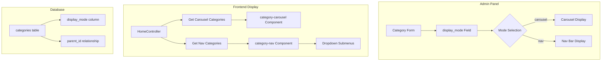

# Design Document: Category Navigation Management

## Overview

This feature extends the existing Category model to support dual display modes. By adding a `display_mode` field, administrators can control whether a category appears in the image-based carousel or the text-based navigation bar. The system leverages the existing parent/child relationship - parent categories with 'nav' mode become navigation bar items with their children as dropdown menus.

## Architecture



## Components and Interfaces

### 1. Database Migration
Add `display_mode` column to categories table:
- Type: ENUM or VARCHAR
- Values: 'carousel', 'nav'
- Default: 'carousel'

### 2. Category Model Updates
- Add `display_mode` to fillable array
- Add scopes: `scopeCarousel()`, `scopeNav()`
- Add accessor for display mode badge

### 3. Admin Category Controller
- Update create/edit forms to include display_mode field
- Update store/update methods to handle display_mode

### 4. Admin Category Views
- Add display_mode dropdown in create/edit forms
- Add display_mode badge in index table
- Add display_mode filter option

### 5. Frontend Components
- Update `category-carousel` to filter by display_mode='carousel'
- Update `category-nav` to filter by display_mode='nav'
- Ensure nav shows parent categories with children as dropdowns

### 6. HomeController Updates
- Pass carousel categories (display_mode='carousel')
- Pass nav categories (display_mode='nav' with children)

## Data Models

### Categories Table (Updated)
```
categories
├── id (bigint, PK)
├── name_en (varchar)
├── name_ar (varchar)
├── name_he (varchar)
├── slug (varchar, unique)
├── description_en (text, nullable)
├── description_ar (text, nullable)
├── description_he (text, nullable)
├── image (text, nullable)
├── icon (varchar, nullable)
├── position (int, default: 0)
├── parent_id (bigint, FK, nullable)
├── is_active (boolean, default: true)
├── display_mode (varchar, default: 'carousel')  <-- NEW
├── order (int, default: 0)
├── meta_title (varchar, nullable)
├── meta_description (text, nullable)
├── meta_keywords (varchar, nullable)
├── created_at (timestamp)
├── updated_at (timestamp)
└── deleted_at (timestamp, nullable)
```

## Correctness Properties

*A property is a characteristic or behavior that should hold true across all valid executions of a system-essentially, a formal statement about what the system should do. Properties serve as the bridge between human-readable specifications and machine-verifiable correctness guarantees.*

### Property 1: Display Mode Segregation
*For any* active parent category, if its display_mode is 'carousel' then it appears only in the carousel component, and if its display_mode is 'nav' then it appears only in the nav component.
**Validates: Requirements 1.2, 1.3, 4.1, 4.2**

### Property 2: Nav Children Rendering
*For any* parent category with display_mode 'nav' and active children, all those children appear as dropdown items under that parent in the navigation bar.
**Validates: Requirements 1.5, 2.1**

### Property 3: Position-Based Ordering
*For any* set of categories in the same display context (carousel or nav), they are ordered by position ascending, then alphabetically by name for equal positions.
**Validates: Requirements 2.4, 3.2, 3.3**

### Property 4: Childless Nav Direct Link
*For any* parent category with display_mode 'nav' and no active children, it renders as a direct link without a dropdown menu.
**Validates: Requirements 2.3**

### Property 5: Default Display Mode
*For any* newly created category without explicit display_mode, the system assigns 'carousel' as the default value.
**Validates: Requirements 1.4**

## Error Handling

| Error Scenario | Handling Strategy |
|----------------|-------------------|
| Invalid display_mode value | Validation rejects, defaults to 'carousel' |
| Category with children switched to carousel | Children remain but don't show in carousel |
| Missing icon for nav category | Display without icon, use text only |
| Circular parent reference | Database constraint prevents |

## Testing Strategy

### Unit Tests
- Test Category model scopes (scopeCarousel, scopeNav)
- Test display_mode default value
- Test category ordering logic

### Property-Based Tests
Using PHPUnit with data providers for property-based testing:

1. **Display Mode Segregation Test**: Generate random categories with different display modes, verify correct component placement
2. **Nav Children Rendering Test**: Generate nav categories with random children, verify all children appear in dropdown
3. **Position Ordering Test**: Generate categories with various positions, verify correct ordering
4. **Childless Nav Test**: Generate nav categories without children, verify direct link rendering
5. **Default Mode Test**: Create categories without display_mode, verify default is 'carousel'

### Integration Tests
- Test admin form submission with display_mode
- Test homepage rendering with both components
- Test category filtering by display_mode

### Test Configuration
- Minimum 100 iterations per property test
- Use Laravel factories for category generation
- Test both Arabic and English locales
