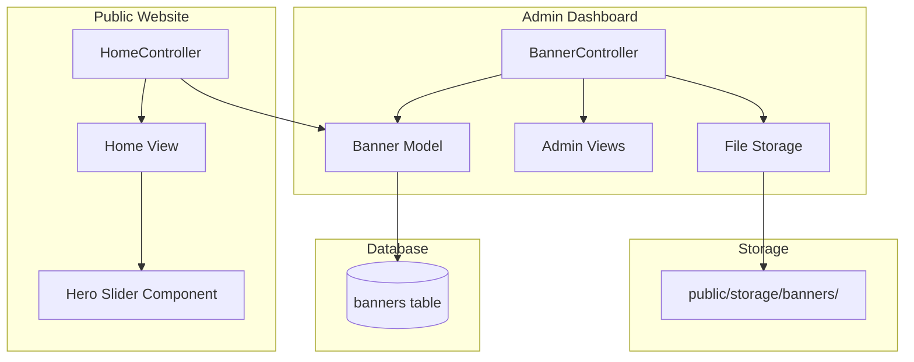

# Design Document: Dynamic Banner Management

## Overview

This feature transforms the static hero banner/slider on the public website into a fully dynamic, admin-manageable system. The implementation follows the existing Laravel patterns in the codebase, utilizing Eloquent models, resource controllers, Blade views, and the established admin dashboard structure.

The system will:
- Store banner data in a new `banners` database table
- Provide CRUD operations through an admin controller
- Handle secure file uploads with validation
- Render dynamic banners on the home page hero slider
- Support multilingual content (English, Arabic, Hebrew)

## Architecture



## Components and Interfaces

### 1. Database Migration

**File:** `database/migrations/YYYY_MM_DD_HHMMSS_create_banners_table.php`

Creates the `banners` table with the following structure:
- `id` - Primary key
- `image_path` - String, stores relative path to uploaded image
- `title_en` - String, nullable, English title
- `title_ar` - String, nullable, Arabic title
- `title_he` - String, nullable, Hebrew title
- `subtitle_en` - String, nullable, English subtitle
- `subtitle_ar` - String, nullable, Arabic subtitle
- `subtitle_he` - String, nullable, Hebrew subtitle
- `link` - String, nullable, optional URL for clickable banner
- `button_text_en` - String, nullable, CTA button text in English
- `button_text_ar` - String, nullable, CTA button text in Arabic
- `button_text_he` - String, nullable, CTA button text in Hebrew
- `display_order` - Integer, default 0, controls banner sequence
- `is_active` - Boolean, default true, controls visibility
- `created_at` - Timestamp
- `updated_at` - Timestamp

### 2. Banner Model

**File:** `app/Models/Banner.php`

```php
class Banner extends Model
{
    protected $fillable = [
        'image_path', 'title_en', 'title_ar', 'title_he',
        'subtitle_en', 'subtitle_ar', 'subtitle_he',
        'link', 'button_text_en', 'button_text_ar', 'button_text_he',
        'display_order', 'is_active'
    ];

    protected $casts = [
        'is_active' => 'boolean',
        'display_order' => 'integer',
    ];

    // Locale-aware accessors for title, subtitle, button_text
    // Scope for active banners ordered by display_order
}
```

### 3. Admin Banner Controller

**File:** `app/Http/Controllers/Admin/BannerController.php`

Methods:
- `index()` - List all banners with pagination
- `create()` - Show create form
- `store(Request $request)` - Validate and store new banner
- `edit(Banner $banner)` - Show edit form
- `update(Request $request, Banner $banner)` - Validate and update banner
- `destroy(Banner $banner)` - Delete banner and associated image

### 4. Admin Views

**Files:**
- `resources/views/admin/banners/index.blade.php` - Banner list with actions
- `resources/views/admin/banners/create.blade.php` - Create form
- `resources/views/admin/banners/edit.blade.php` - Edit form

### 5. Routes

**File:** `routes/web.php`

```php
Route::middleware(['auth', 'admin'])->prefix('admin')->name('admin.')->group(function () {
    Route::resource('banners', BannerController::class);
});
```

### 6. Home Controller Integration

**File:** `app/Http/Controllers/HomeController.php`

Modify to fetch active banners:
```php
$banners = Banner::where('is_active', true)
    ->orderBy('display_order', 'asc')
    ->orderBy('created_at', 'asc')
    ->get();
```

### 7. Home View Integration

**File:** `resources/views/home.blade.php`

Replace static hero slides with dynamic loop:
```blade
@foreach($banners as $index => $banner)
    <div class="hero-slide {{ $index === 0 ? 'active' : '' }}" 
         style="background-image: url('{{ $banner->image_url }}');">
        <!-- Dynamic content -->
    </div>
@endforeach
```

## Data Models

### Banner Entity

| Field | Type | Constraints | Description |
|-------|------|-------------|-------------|
| id | bigint | PK, auto-increment | Unique identifier |
| image_path | varchar(255) | required | Relative path to stored image |
| title_en | varchar(255) | nullable | English title overlay |
| title_ar | varchar(255) | nullable | Arabic title overlay |
| title_he | varchar(255) | nullable | Hebrew title overlay |
| subtitle_en | text | nullable | English subtitle/description |
| subtitle_ar | text | nullable | Arabic subtitle/description |
| subtitle_he | text | nullable | Hebrew subtitle/description |
| link | varchar(255) | nullable | Optional clickable URL |
| button_text_en | varchar(100) | nullable | English CTA button text |
| button_text_ar | varchar(100) | nullable | Arabic CTA button text |
| button_text_he | varchar(100) | nullable | Hebrew CTA button text |
| display_order | int | default 0 | Sort order (ascending) |
| is_active | boolean | default true | Visibility flag |
| created_at | timestamp | auto | Creation timestamp |
| updated_at | timestamp | auto | Last update timestamp |

## Correctness Properties

*A property is a characteristic or behavior that should hold true across all valid executions of a system-essentially, a formal statement about what the system should do. Properties serve as the bridge between human-readable specifications and machine-verifiable correctness guarantees.*

### Property 1: File Type Validation
*For any* file upload attempt, if the file MIME type is not in the allowed list (image/jpeg, image/png, image/gif, image/webp), the system should reject the upload with a validation error.
**Validates: Requirements 1.2, 8.1**

### Property 2: Unique Filename Generation
*For any* two banner uploads (even with identical original filenames), the stored filenames should be unique and the files should be stored in the banners directory with relative paths in the database.
**Validates: Requirements 8.2, 8.3, 8.4**

### Property 3: Image Update Invariant
*For any* banner update operation, if a new image is provided the old image should be replaced; if no new image is provided the existing image path should remain unchanged.
**Validates: Requirements 3.2, 3.3**

### Property 4: Active Status Filtering
*For any* set of banners in the database, the public home page should display only banners where is_active equals true.
**Validates: Requirements 3.4, 6.1**

### Property 5: Display Order Sorting
*For any* set of active banners, the Hero_Slider should display them sorted by display_order in ascending order, with creation timestamp as secondary sort for equal display_order values.
**Validates: Requirements 5.2, 5.3, 6.2**

### Property 6: Clickable Link Rendering
*For any* banner with a non-null link value, the rendered HTML should contain an anchor element with that URL as the href attribute.
**Validates: Requirements 2.3, 6.3**

### Property 7: Title Locale Resolution
*For any* banner and any locale (en, ar, he), the title accessor should return the title for that locale, falling back to English if the locale-specific title is empty.
**Validates: Requirements 2.4, 9.2**

### Property 8: Authorization Enforcement
*For any* HTTP request to banner management routes, non-admin users should receive a redirect or 403 response, while admin users should receive successful responses for valid operations.
**Validates: Requirements 7.1, 7.2**

### Property 9: Deletion Cleanup
*For any* banner deletion operation, both the database record and the associated image file should be removed from the system.
**Validates: Requirements 4.2**

### Property 10: Title Validation
*For any* banner creation or update attempt, if all title fields (title_en, title_ar, title_he) are empty or null, the system should reject the operation with a validation error.
**Validates: Requirements 9.3**

## Error Handling

### File Upload Errors
- Invalid file type: Return validation error with message "The image must be a file of type: jpg, jpeg, png, gif, webp."
- File too large: Return validation error with message "The image must not be greater than 5MB."
- Storage failure: Log error and return generic error message to user

### Database Errors
- Constraint violations: Catch and return user-friendly error message
- Connection failures: Display maintenance message

### Authorization Errors
- Non-admin access: Redirect to login or return 403 Forbidden
- CSRF token mismatch: Return 419 Page Expired

## Testing Strategy

### Dual Testing Approach

This feature will use both unit tests and property-based tests to ensure comprehensive coverage.

### Unit Tests

Unit tests will cover:
- Banner model accessor methods (title, subtitle, button_text by locale)
- File upload validation rules
- Controller redirect behavior
- View rendering with banner data

### Property-Based Tests

**Library:** PHPUnit with custom data providers for property-based testing patterns

Property-based tests will verify:
1. File type validation rejects all non-image MIME types
2. Unique filenames are generated for concurrent uploads
3. Image update operations preserve or replace images correctly
4. Active status filtering works for all combinations
5. Display order sorting is consistent
6. Link rendering produces valid anchor elements
7. Locale resolution follows fallback rules
8. Authorization blocks all non-admin users
9. Deletion removes both database records and files
10. Title validation enforces at least one title

Each property-based test will:
- Run a minimum of 100 iterations
- Use generators to create random valid/invalid inputs
- Tag with the corresponding correctness property reference

**Test File:** `tests/Feature/BannerManagementPropertyTest.php`

Format for property test annotations:
```php
/**
 * **Feature: dynamic-banner-management, Property 1: File Type Validation**
 * @test
 */
public function file_type_validation_rejects_non_images()
```
