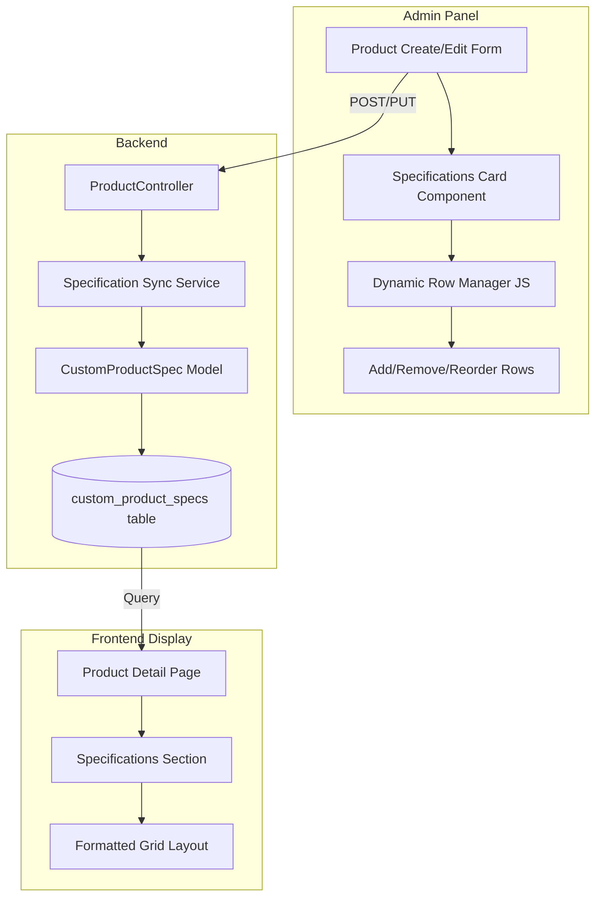

# Design Document: Dynamic Product Specifications

## Overview

This feature enhances the existing product management system by allowing administrators to add custom key-value specifications directly within the product create/edit forms. The design leverages the existing `product_spec_values` table structure while introducing a new `custom_product_specs` table for ad-hoc specifications that don't require pre-defined templates.

The system will provide:
- A dynamic JavaScript-powered UI for adding/removing specification rows
- Multilingual support for specification labels (EN, AR, HE)
- Drag-and-drop reordering capability
- Seamless integration with the existing product forms
- Professional display on the product detail page

## Architecture



## Components and Interfaces

### 1. Database Migration

**New Table: `custom_product_specs`**

```php
Schema::create('custom_product_specs', function (Blueprint $table) {
    $table->id();
    $table->foreignId('product_id')->constrained()->onDelete('cascade');
    $table->string('label_en', 100);
    $table->string('label_ar', 100)->nullable();
    $table->string('label_he', 100)->nullable();
    $table->string('value', 500);
    $table->integer('sort_order')->default(0);
    $table->timestamps();
    
    $table->index(['product_id', 'sort_order']);
});
```

### 2. CustomProductSpec Model

```php
class CustomProductSpec extends Model
{
    protected $fillable = [
        'product_id',
        'label_en',
        'label_ar', 
        'label_he',
        'value',
        'sort_order',
    ];

    public function product(): BelongsTo;
    public function getLabelAttribute(): string; // Returns localized label
}
```

### 3. Product Model Enhancement

Add relationship and helper methods to the existing Product model:

```php
// New relationship
public function customSpecs(): HasMany
{
    return $this->hasMany(CustomProductSpec::class)->orderBy('sort_order');
}

// Sync method for form submission
public function syncCustomSpecs(array $specs): void;

// Enhanced formatted specifications getter
public function getFormattedSpecificationsAttribute(): array;
```

### 4. ProductController Updates

Modify `store()` and `update()` methods to handle custom specifications:

```php
// In store/update methods
$customSpecs = $request->input('custom_specs', []);
$product->syncCustomSpecs($customSpecs);
```

### 5. Admin UI Component

**Blade Partial: `admin/products/_specifications-card.blade.php`**

A reusable card component containing:
- Section header with icon
- Container for specification rows
- "Add Specification" button
- JavaScript for dynamic row management

**Row Structure:**
```html
<div class="spec-row" data-index="0">
    <div class="drag-handle"><i class="fas fa-grip-vertical"></i></div>
    <input name="custom_specs[0][label_en]" placeholder="Label (English)">
    <input name="custom_specs[0][label_ar]" placeholder="Label (Arabic)" dir="rtl">
    <input name="custom_specs[0][label_he]" placeholder="Label (Hebrew)" dir="rtl">
    <input name="custom_specs[0][value]" placeholder="Value">
    <button class="remove-spec-btn"><i class="fas fa-trash"></i></button>
</div>
```

### 6. JavaScript Module

**File: `public/js/admin/product-specifications.js`**

```javascript
class ProductSpecificationsManager {
    constructor(container);
    addRow(data = null);
    removeRow(index);
    initSortable();
    updateIndexes();
    getSpecifications();
}
```

## Data Models

### CustomProductSpec Entity

| Field | Type | Constraints | Description |
|-------|------|-------------|-------------|
| id | bigint | PK, auto-increment | Unique identifier |
| product_id | bigint | FK, cascade delete | Reference to product |
| label_en | varchar(100) | required | English label |
| label_ar | varchar(100) | nullable | Arabic label |
| label_he | varchar(100) | nullable | Hebrew label |
| value | varchar(500) | required | Specification value |
| sort_order | int | default 0 | Display order |
| created_at | timestamp | auto | Creation timestamp |
| updated_at | timestamp | auto | Update timestamp |

### Request Validation Rules

```php
'custom_specs' => 'nullable|array',
'custom_specs.*.label_en' => 'required_with:custom_specs.*.value|string|max:100',
'custom_specs.*.label_ar' => 'nullable|string|max:100',
'custom_specs.*.label_he' => 'nullable|string|max:100',
'custom_specs.*.value' => 'required_with:custom_specs.*.label_en|string|max:500',
```

## Correctness Properties

*A property is a characteristic or behavior that should hold true across all valid executions of a system-essentially, a formal statement about what the system should do. Properties serve as the bridge between human-readable specifications and machine-verifiable correctness guarantees.*

### Property 1: Specification Persistence Round-Trip

*For any* product and any set of valid custom specifications, saving the product with those specifications and then loading the product should return specifications with equivalent labels and values in the same order.

**Validates: Requirements 1.4, 2.1, 2.4**

### Property 2: Empty Specification Removal

*For any* product form submission containing specification entries where both label_en and value are empty or whitespace-only, those entries should not be persisted to the database.

**Validates: Requirements 2.5**

### Property 3: Label Length Validation

*For any* specification label string, the system should accept strings up to 100 characters and reject strings exceeding 100 characters with a validation error.

**Validates: Requirements 1.3**

### Property 4: Value Length Validation

*For any* specification value string, the system should accept strings up to 500 characters and reject strings exceeding 500 characters with a validation error.

**Validates: Requirements 1.3**

### Property 5: Locale Fallback Behavior

*For any* specification with label_en set but label_ar and label_he empty, retrieving the label in Arabic or Hebrew locale should return the English label as fallback.

**Validates: Requirements 3.2, 3.3**

### Property 6: Display Order Preservation

*For any* set of specifications with defined sort_order values, the formatted specifications array should return items in ascending sort_order sequence.

**Validates: Requirements 4.2**

### Property 7: Cascade Delete on Product Removal

*For any* product with associated custom specifications, deleting the product should result in zero custom specifications remaining for that product_id.

**Validates: Requirements 6.2**

### Property 8: Validation Error on Invalid Data

*For any* form submission with a specification containing a value but no label_en, the system should return a validation error and not persist the specification.

**Validates: Requirements 5.3**

## Error Handling

| Error Scenario | Handling Strategy |
|----------------|-------------------|
| Validation failure | Return to form with error messages, preserve input |
| Database constraint violation | Catch exception, display user-friendly error |
| JavaScript disabled | Form degrades to static inputs, server handles indexing |
| Duplicate specification labels | Allow (not enforced as unique) |
| Empty specifications array | Skip processing, no error |

## Testing Strategy

### Unit Tests

Unit tests will verify individual component behavior:

1. **CustomProductSpec Model Tests**
   - Test `getLabelAttribute()` returns correct locale-based label
   - Test fallback behavior when locale-specific label is null
   - Test relationship with Product model

2. **Product Model Tests**
   - Test `syncCustomSpecs()` creates new specifications
   - Test `syncCustomSpecs()` updates existing specifications
   - Test `syncCustomSpecs()` removes deleted specifications
   - Test `getFormattedSpecificationsAttribute()` combines template and custom specs

3. **Validation Tests**
   - Test label_en max length validation (100 chars)
   - Test value max length validation (500 chars)
   - Test required_with validation rules

### Property-Based Tests

Property-based tests will use **Pest PHP with Faker** for generating test data. Each test will run a minimum of 100 iterations.

**Test File: `tests/Feature/ProductSpecificationPropertyTest.php`**

Properties to implement:
1. Round-trip persistence property
2. Empty specification removal property
3. Label length validation property
4. Value length validation property
5. Locale fallback property
6. Display order preservation property
7. Cascade delete property
8. Validation error property

### Integration Tests

1. **Admin Form Integration**
   - Test product create with specifications
   - Test product edit with specification modifications
   - Test specification deletion via form

2. **Frontend Display Integration**
   - Test product detail page renders specifications
   - Test RTL rendering for Arabic/Hebrew locales
