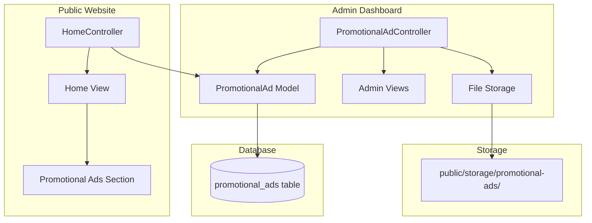

# Design Document: Home Promotional Ads Management

## Overview

هذه الميزة تحول الإعلانات الترويجية الثابتة في الصفحة الرئيسية (Strong Offers و International Gift Store banners) إلى نظام ديناميكي قابل للإدارة. التنفيذ يتبع أنماط Laravel الموجودة في الكود، باستخدام Eloquent models و resource controllers و Blade views وهيكل لوحة التحكم الحالي.

النظام سيقوم بـ:
- تخزين بيانات الإعلانات الترويجية في جدول `promotional_ads` جديد
- توفير عمليات CRUD من خلال controller في لوحة التحكم
- التعامل مع رفع الملفات بشكل آمن مع التحقق
- عرض الإعلانات الديناميكية في الصفحة الرئيسية بنفس المقاسات الحالية
- دعم موقعين للإعلانات (يسار ويمين)

## Architecture



## Components and Interfaces

### 1. Database Migration

**File:** `database/migrations/YYYY_MM_DD_HHMMSS_create_promotional_ads_table.php`

Creates the `promotional_ads` table with the following structure:
- `id` - Primary key
- `image_path` - String, stores relative path to uploaded image
- `position` - Enum ('left', 'right'), position of the ad
- `link` - String, nullable, URL for clickable ad
- `is_active` - Boolean, default true, controls visibility
- `created_at` - Timestamp
- `updated_at` - Timestamp

### 2. PromotionalAd Model

**File:** `app/Models/PromotionalAd.php`

```php
class PromotionalAd extends Model
{
    protected $fillable = [
        'image_path', 'position', 'link', 'is_active'
    ];

    protected $casts = [
        'is_active' => 'boolean',
    ];

    // Accessor for full image URL
    // Scope for active ads
    // Scope for position filtering
}
```

### 3. Admin PromotionalAd Controller

**File:** `app/Http/Controllers/Admin/PromotionalAdController.php`

Methods:
- `index()` - List all promotional ads
- `create()` - Show create form
- `store(Request $request)` - Validate and store new ad
- `edit(PromotionalAd $promotionalAd)` - Show edit form
- `update(Request $request, PromotionalAd $promotionalAd)` - Validate and update ad
- `destroy(PromotionalAd $promotionalAd)` - Delete ad and associated image

### 4. Admin Views

**Files:**
- `resources/views/admin/promotional-ads/index.blade.php` - Ad list with actions
- `resources/views/admin/promotional-ads/create.blade.php` - Create form
- `resources/views/admin/promotional-ads/edit.blade.php` - Edit form

### 5. Routes

**File:** `routes/web.php`

```php
Route::middleware(['auth', 'admin'])->prefix('admin')->name('admin.')->group(function () {
    Route::resource('promotional-ads', PromotionalAdController::class);
});
```

### 6. Home Controller Integration

**File:** `app/Http/Controllers/HomeController.php`

Modify to fetch active promotional ads:
```php
$promotionalAds = PromotionalAd::where('is_active', true)
    ->orderBy('updated_at', 'desc')
    ->get()
    ->keyBy('position');
```

### 7. Home View Integration

**File:** `resources/views/home.blade.php`

Replace static promotional ads with dynamic content:
```blade
@if(isset($promotionalAds['left']))
    <div class="product-item-section gift-idea-banner" 
         style="background-image: url('{{ $promotionalAds['left']->image_url }}');"
         onclick="window.location.href='{{ $promotionalAds['left']->link }}'">
    </div>
@endif
```

## Data Models

### PromotionalAd Entity

| Field | Type | Constraints | Description |
|-------|------|-------------|-------------|
| id | bigint | PK, auto-increment | Unique identifier |
| image_path | varchar(255) | required | Relative path to stored image |
| position | enum | required, in:left,right | Position of ad (left or right) |
| link | varchar(255) | nullable | Optional clickable URL |
| is_active | boolean | default true | Visibility flag |
| created_at | timestamp | auto | Creation timestamp |
| updated_at | timestamp | auto | Last update timestamp |

## Correctness Properties

*A property is a characteristic or behavior that should hold true across all valid executions of a system-essentially, a formal statement about what the system should do. Properties serve as the bridge between human-readable specifications and machine-verifiable correctness guarantees.*

### Property 1: File Type Validation
*For any* file upload attempt, if the file MIME type is not in the allowed list (image/jpeg, image/png, image/gif, image/webp), the system should reject the upload with a validation error.
**Validates: Requirements 1.2, 7.1**

### Property 2: Secure File Storage
*For any* two promotional ad uploads (even with identical original filenames), the stored filenames should be unique, stored in the promotional-ads directory, and the database should contain relative paths.
**Validates: Requirements 7.2, 7.3, 7.4**

### Property 3: Image Update Invariant
*For any* promotional ad update operation, if a new image is provided the old image should be replaced; if no new image is provided the existing image path should remain unchanged.
**Validates: Requirements 3.2, 3.3**

### Property 4: Active Status Filtering
*For any* set of promotional ads in the database, the public home page should display only ads where is_active equals true.
**Validates: Requirements 3.4, 5.1**

### Property 5: Position Assignment
*For any* set of active promotional ads, each position (left/right) should display at most one ad, using the most recently updated active ad for that position.
**Validates: Requirements 2.4, 8.4**

### Property 6: Clickable Link Rendering
*For any* promotional ad with a non-null link value, the rendered HTML should contain a clickable element with that URL.
**Validates: Requirements 2.3, 5.3**

### Property 7: Authorization Enforcement
*For any* HTTP request to promotional ad management routes, non-admin users should receive a redirect or 403 response, while admin users should receive successful responses for valid operations.
**Validates: Requirements 6.1, 6.2**

### Property 8: Deletion Cleanup
*For any* promotional ad deletion operation, both the database record and the associated image file should be removed from the system.
**Validates: Requirements 4.2**

### Property 9: Position Validation
*For any* promotional ad creation or update attempt, if the position value is not 'left' or 'right', the system should reject the operation with a validation error.
**Validates: Requirements 8.3**

### Property 10: Image Required for New Ads
*For any* new promotional ad creation attempt without an image file, the system should reject the operation with a validation error.
**Validates: Requirements 8.2**

## Error Handling

### File Upload Errors
- Invalid file type: Return validation error with message "The image must be a file of type: jpg, jpeg, png, gif, webp."
- Storage failure: Log error and return generic error message to user

### Database Errors
- Constraint violations: Catch and return user-friendly error message
- Connection failures: Display maintenance message

### Authorization Errors
- Non-admin access: Redirect to login or return 403 Forbidden
- CSRF token mismatch: Return 419 Page Expired

## Testing Strategy

### Dual Testing Approach

This feature will use both unit tests and property-based tests to ensure comprehensive coverage.

### Unit Tests

Unit tests will cover:
- PromotionalAd model accessor methods (image_url)
- File upload validation rules
- Controller redirect behavior
- View rendering with promotional ad data

### Property-Based Tests

**Library:** PHPUnit with custom data providers for property-based testing patterns

Property-based tests will verify:
1. File type validation rejects all non-image MIME types
2. Unique filenames are generated for concurrent uploads
3. Image update operations preserve or replace images correctly
4. Active status filtering works for all combinations
5. Position assignment uses most recent active ad
6. Link rendering produces valid clickable elements
7. Authorization blocks all non-admin users
8. Deletion removes both database records and files
9. Position validation enforces left/right values
10. Image is required for new ad creation

Each property-based test will:
- Run a minimum of 100 iterations
- Use generators to create random valid/invalid inputs
- Tag with the corresponding correctness property reference

**Test File:** `tests/Feature/PromotionalAdPropertyTest.php`

Format for property test annotations:
```php
/**
 * **Feature: home-promotional-ads, Property 1: File Type Validation**
 * @test
 */
public function file_type_validation_rejects_non_images()
```
